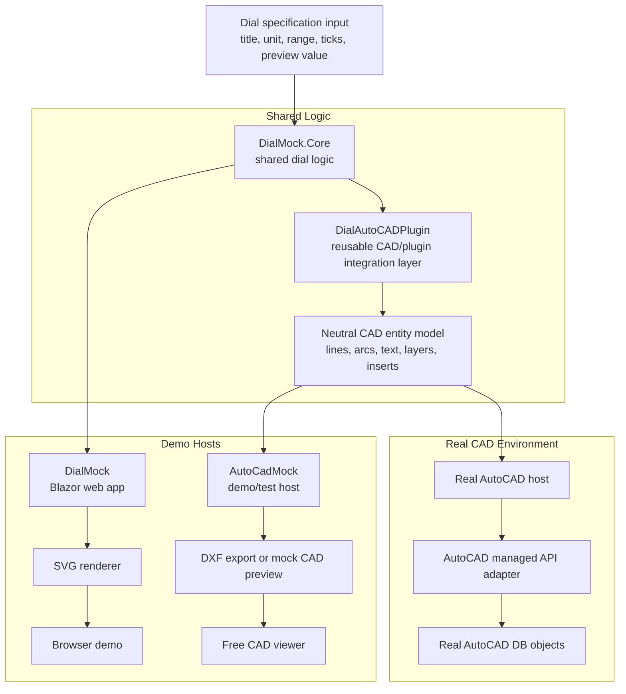

# C# Technical Prototypes

This repository contains C# technical prototype projects, simulations, and interface experiments.

The purpose of this workspace is to build reusable technical components with clear architectural separation between:

- domain logic
- UI rendering
- CAD integration
- CAD export pipelines
- external host simulation

## Layered Architecture

The current architectural layers are:

- **DialMock.Core**: business rules and neutral dial geometry
- **DialMock**: Blazor UI for interactive SVG preview
- **DialMock.CadModel**: neutral CAD contract
- **DialAutoCADPlugin**: reusable CAD/plugin integration layer
- **AutoCadMock**: simulated host that calls the plugin
- **DXF export service**: plugin-side reusable service
- **future real AutoCAD adapter**: maps the same CAD model into AutoCAD DB objects inside transactions

The intent is:

- the **Blazor UI** uses Core to preview the dial as SVG
- the **CAD/plugin path** uses Core to build dial geometry, converts it to a CAD-neutral model, and makes it reusable for:
  - DXF export
  - host simulation
  - future real AutoCAD integration

---

## Current Status

**Work in progress**

Implemented so far:

- `DialMock.Core`
- `DialMock`
- `DialMock.CadModel`
- `DialAutoCADPlugin`
- `AutoCadMock`
- plugin request boundary via `DialCadRequest`
- CAD summary output from the simulated host

Not yet implemented:

- DXF export
- real AutoCAD adapter
- native AutoCAD DB object creation
- CAD-viewer validation roundtrip

---

## Repository Structure

<details>
<summary>Click to expand directory structure</summary>

```text
.
├── AutoCadMock/               Console host simulator
│   ├── Diagnostics/
│   ├── Program.cs
│   └── AutoCadMock.csproj
│
├── DialAutoCADPlugin/         CAD integration layer
│   ├── Abstractions/
│   ├── Mapping/
│   ├── Models/
│   ├── Services/
│   └── DialAutoCADPlugin.csproj
│
├── DialMock/                  Blazor UI preview
│   ├── Components/
│   ├── Rendering/
│   ├── Services/
│   └── DialMock.csproj
│
├── DialMock.CadModel/         CAD-neutral entity model
│   ├── Geometry/
│   ├── Model/
│   └── DialMock.CadModel.csproj
│
├── DialMock.Core/             Domain logic and geometry generation
│   ├── Engine/
│   ├── Geometry/
│   ├── Models/
│   ├── Samples/
│   ├── Services/
│   └── DialMock.Core.csproj
│
├── DialMock.Tests/            Unit tests
│
├── docs/                      Project documentation
│   ├── architecture.md
│   ├── cicd.md
│   ├── developer-guide.md
│   ├── install.md
│   ├── apache.md
│   ├── test.md
│   ├── history.md
│   ├── version.md
│   └── project-presentation-for-wordpress.md
│
├── scripts/                   CI helper scripts
├── Dockerfile
├── Jenkinsfile.ci
├── Jenkinsfile.deploy
├── DialMock.slnx
├── TODO.md
├── VERSION
└── README.md
````

</details>

---

## Architecture Overview



### Architectural Notes

* `DialMock.Core` remains renderer-neutral.
* `DialMock.CadModel` is not a second business layer; it is a CAD-shaped neutral contract.
* `DialAutoCADPlugin` owns the plugin-facing request contract and the CAD mapping logic.
* `AutoCadMock` simulates how an external CAD host would call the plugin.
* DXF export belongs to the reusable CAD/plugin side, not to Core business logic.
* Future real AutoCAD integration should adapt the same CAD model into native AutoCAD database objects.

---

## Project Roles

### DialMock.Core

Domain logic and geometry generation.

Responsibilities:

* validation rules
* dial geometry generation
* neutral drawing output
* sample dial definitions

Key outputs:

```text
DialDrawing
Line2
Arc2
Text2
Point2
```

Core contains **no UI logic** and **no CAD export logic**.

---

### DialMock

Blazor-based dial preview application.

Responsibilities:

* user input
* validation display
* SVG rendering
* visual debugging

Used as:

* visualization tool
* geometry validation UI
* development sandbox

---

### DialMock.CadModel

Neutral CAD entity model.

Responsibilities:

* represent CAD geometry
* maintain layer structure
* remain independent from CAD vendors

Key entities:

```text
CadDrawing
CadEntity
CadLine
CadArc
CadCircle
CadText
CadLayer
```

Contains **no export logic** and **no business rules**.

---

### DialAutoCADPlugin

Reusable CAD integration layer.

Responsibilities:

* accept plugin-facing request input
* convert request to Core input
* validate input
* generate geometry via Core
* map geometry to CAD entities
* later provide reusable DXF export services

Public API:

```csharp
CadDrawing Build(DialCadRequest request);
```

Important:

The plugin owns the external request contract:

```text
DialCadRequest
```

This isolates Core from external consumers and makes the plugin callable by a simulated or future real CAD host.

---

### AutoCadMock

Console-based host simulator.

Responsibilities:

* simulate an external CAD host
* invoke plugin services
* generate diagnostic output
* later drive DXF export scenarios

Used for:

* integration testing
* pipeline validation
* CAD workflow simulation

This project **does not reference Core**.

---

## Current Functional Capabilities

The system currently supports:

* dial rule validation
* dial geometry generation
* CAD entity generation
* layered drawing output
* host-based diagnostics
* SVG preview rendering
* unit testing of geometry logic

Typical output example:

```text
CAD DRAWING SUMMARY
===================
Layers   : 4
Entities : 24

Layers:
- DIAL_ARC
- DIAL_TICKS
- DIAL_LABELS
- DIAL_NEEDLE
```

---

## Development

From repository root:

```bash
dotnet restore
dotnet build
```

Run the Blazor UI:

```bash
dotnet run --project DialMock/DialMock.csproj
```

Run the CAD host simulator:

```bash
dotnet run --project AutoCadMock/AutoCadMock.csproj
```

Run tests:

```bash
dotnet test DialMock.slnx
```

---

## CI/CD

Automated pipelines are configured using:

```text
Jenkinsfile.ci
Jenkinsfile.deploy
Dockerfile
scripts/
```

See:

```text
docs/cicd.md
```

---

## Documentation

Detailed documentation is available under:

```text
docs/
```

Important files:

```text
architecture.md        system architecture
developer-guide.md     development notes
install.md             development installation
cicd.md                CI/CD pipeline details
apache.md              Apache and DNS configuration
test.md                functional test reference
history.md             version history
version.md             versioning rules
```

---

## Roadmap (Short-Term)

Upcoming phases:

```text
Phase 5 — CAD mapping refinement
Phase 6 — DXF export implementation
Phase 7 — external CAD validation
Phase 8 — extended test coverage
```

---

## License

MIT License

See `LICENSE`.
 