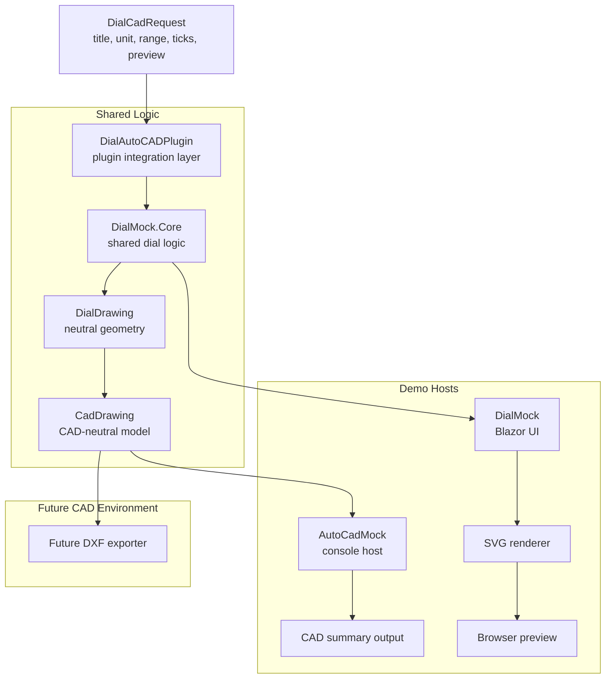

# C# Technical Prototypes

This repository contains C## technical prototype projects, simulations, and interface experiments.

The purpose of this workspace is to build reusable technical components with clear architectural separation between:

- domain logic
- UI rendering
- CAD export pipelines
- external host simulation

The main working prototype currently implemented is:

**DialMock** — a configurable dial and gauge simulation system capable of generating:

- SVG previews (Blazor UI)
- neutral CAD geometry
- host-ready CAD drawing output

---

## Current Status

 WORK IN PROGRESS


---

## Repository Structure

```text
.
├── AutoCadMock/               Console host simulator
│   ├── Diagnostics/
│   ├── Program.cs
│   └── AutoCadMock.csproj
│
├── DialAutoCADPlugin/         CAD integration layer
│   ├── Abstractions/
│   ├── Mapping/
│   ├── Models/
│   ├── Services/
│   └── DialAutoCADPlugin.csproj
│
├── DialMock/                  Blazor UI preview
│   ├── Components/
│   ├── Rendering/
│   ├── Services/
│   └── DialMock.csproj
│
├── DialMock.CadModel/         CAD-neutral entity model
│   ├── Geometry/
│   ├── Model/
│   └── DialMock.CadModel.csproj
│
├── DialMock.Core/             Domain logic and geometry generation
│   ├── Engine/
│   ├── Geometry/
│   ├── Models/
│   ├── Samples/
│   ├── Services/
│   └── DialMock.Core.csproj
│
├── DialMock.Tests/            Unit tests
│
├── docs/                      Project documentation
│   ├── architecture.md
│   ├── cicd.md
│   ├── developer-guide.md
│   ├── install.md
│   ├── apache.md
│   ├── test.md
│
├── scripts/                   CI helper scripts
├── Dockerfile
├── Jenkinsfile.ci
├── Jenkinsfile.deploy
├── DialMock.slnx
├── TODO.md
├── VERSION
└── README.md
```

---

## Architecture Overview



---

## Project Roles

### DialMock.Core

Domain logic and geometry generation.

Responsibilities:

* validation rules
* dial geometry generation
* neutral drawing output
* sample dial definitions

Key outputs:

```text
DialDrawing
Line2
Arc2
Text2
Point2
```

Core contains **no UI logic** and **no CAD export logic**.

---

### DialMock

Blazor-based dial preview application.

Responsibilities:

* user input
* validation display
* SVG rendering
* visual debugging

Used as:

* visualization tool
* geometry validation UI
* development sandbox

---

### DialMock.CadModel

Neutral CAD entity model.

Responsibilities:

* represent CAD geometry
* maintain layer structure
* remain independent from CAD vendors

Key entities:

```text
CadDrawing
CadEntity
CadLine
CadArc
CadCircle
CadText
CadLayer
```

Contains **no export logic**.

---

### DialAutoCADPlugin

Reusable CAD integration layer.

Responsibilities:

* convert request → Core spec
* validate input
* generate geometry
* map geometry to CAD entities

Public API:

```csharp
CadDrawing Build(DialCadRequest request);
```

Important:

The plugin owns the **external request contract**:

```text
DialCadRequest
```

This isolates Core from external consumers.

---

### AutoCadMock

Console-based host simulator.

Responsibilities:

* simulate external CAD host
* invoke plugin services
* generate diagnostic output

Used for:

* integration testing
* pipeline validation
* CAD workflow simulation

This project **does not reference Core**.

---

## Current Functional Capabilities

The system currently supports:

* dial rule validation
* dial geometry generation
* CAD entity generation
* layered drawing output
* host-based diagnostics
* SVG preview rendering
* unit testing of geometry logic

Typical output example:

```text
CAD DRAWING SUMMARY
===================
Layers   : 4
Entities : 24

Layers:
- DIAL_ARC
- DIAL_TICKS
- DIAL_LABELS
- DIAL_NEEDLE
```

---

## Development

From repository root:

```bash
dotnet restore
dotnet build
```

Run the Blazor UI:

```bash
dotnet run --project DialMock/DialMock.csproj
```

Run the CAD host simulator:

```bash
dotnet run --project AutoCadMock/AutoCadMock.csproj
```

Run tests:

```bash
dotnet test DialMock.slnx
```

---

## CI/CD

Automated pipelines are configured using:

```text
Jenkinsfile.ci
Jenkinsfile.deploy
Dockerfile
scripts/
```

See:

```text
docs/cicd.md
```

---

## Documentation

Detailed documentation is available under:

```text
docs/
```

Important files:

```text
architecture.md        system architecture
developer-guide.md     development notes
install.md             development installation
cicd.md                CI/CD pipeline details
apache.md              Apache and DNS configuration
test.md                functional test reference
history.md             version history
version.md             versioning rules
```

---

## Roadmap (Short-Term)

Upcoming phases:

```text
Phase 5 — CAD mapping refinement
Phase 6 — DXF export implementation
Phase 7 — external CAD validation
Phase 8 — extended test coverage
```

---

## License

MIT License

(See LICENSE file)
