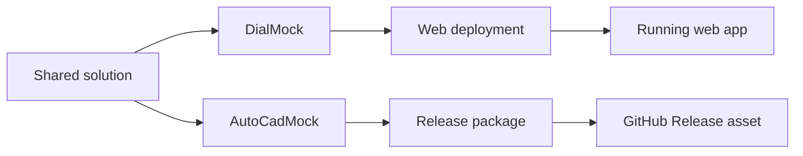

# DialMock / AutoCadMock

A C# prototype workspace for dial-generation workflows across **web**, **desktop**, and **future CAD integration** paths.

The repository demonstrates how the same dial logic can be reused through different runtime hosts:

- **DialMock** — Blazor web host for SVG preview
- **AutoCadMock** — Avalonia desktop host for CAD-side simulation and DXF generation
- **DialAutoCADPlugin** — reusable CAD-oriented integration layer shared by the CAD path

---

## What this project shows

This workspace demonstrates:

- clean separation between domain logic, rendering, and CAD integration
- reuse of the same core logic across multiple hosts
- neutral CAD modeling before vendor-specific integration
- DXF export as a reusable output path
- Docker-based build and packaging workflows
- Jenkins-based CI, web deploy, and desktop release automation

---

## Current runtime model

The repository contains **two real runtime hosts**.

### DialMock

Blazor web host for:

- dial input
- validation feedback
- SVG rendering
- browser-based preview

Runtime model:

- packaged and deployed as a web application
- delivered through the web deployment pipeline

### AutoCadMock

Avalonia desktop host for:

- CAD-side workflow simulation
- request construction
- plugin invocation
- DXF generation
- desktop-side validation

Runtime model:

- packaged as a desktop release artifact
- published for download through GitHub Releases
- run locally outside Docker

---

## Architecture

```mermaid
graph TD
    A[DialSpec input]

    A --> B[DialMock.Core<br/>shared dial logic]

    B --> C[DialMock<br/>web host]
    C --> D[SVG renderer]
    D --> E[Browser demo]

    B --> F[DialAutoCADPlugin<br/>reusable CAD integration layer]
    F --> G[Neutral CAD model]

    G --> H[AutoCadMock<br/>desktop mock host]
    H --> I[DXF exporter]
    I --> J[DXF viewer]

    G --> K[Future AutoCAD host<br/>planned]
    K --> L[AutoCAD API adapter<br/>planned]
    L --> M[AutoCAD DB entities<br/>planned]

    subgraph Implemented today
        B
        C
        D
        E
        F
        G
        H
        I
        J
    end

    subgraph Planned integration
        K
        L
        M
    end
````

---

## Main projects

### `DialMock.Core`

Shared domain logic.

Responsibilities:

* dial validation
* geometry generation
* neutral dial drawing output

### `DialMock`

Blazor web host.

Responsibilities:

* user interaction
* SVG preview
* validation display

### `DialMock.CadModel`

Neutral CAD contract.

Responsibilities:

* CAD-shaped drawing model
* lines, arcs, circles, text, layers
* vendor-independent representation

### `DialAutoCADPlugin`

Reusable CAD-oriented integration layer.

Responsibilities:

* accept `DialCadRequest`
* convert request to core input
* validate and generate geometry
* map to CAD-neutral entities
* export DXF

### `AutoCadMock`

Avalonia desktop host.

Responsibilities:

* collect user input
* create `DialCadRequest`
* call plugin services
* generate DXF output
* simulate external CAD host behavior

---

## Current capabilities

Implemented today:

* dial rule validation
* dial geometry generation
* SVG preview
* CAD-neutral entity generation
* normalized CAD-style arc representation
* DXF export
* interactive desktop host
* LibreCAD validation
* automated tests
* Docker-based CI
* Jenkins web deployment
* Jenkins desktop build-and-release pipeline
* GitHub desktop release publishing

Planned later:

* real AutoCAD host integration
* AutoCAD API adapter
* AutoCAD DB object creation
* print/plot framing strategy
* optional headless execution mode
* Windows desktop release asset

---

## CI/CD

The repository currently uses **three Jenkins pipelines**:

* **`Jenkinsfile.ci`** — build, test, and publish artifacts
* **`Jenkinsfile.deploy`** — deploy the `DialMock` web application
* **`Jenkinsfile.desktop-release`** — build the `AutoCadMock` desktop package and publish it as a GitHub Release asset

The pipeline model is now:

* **DialMock** → web deployment path
* **AutoCadMock** → desktop release path

```mermaid
flowchart TD
    A[GitHub push] --> B[Jenkins CI]
    A --> C[Jenkins Deploy]
    A --> D[Jenkins Desktop Release]

    B --> E[Build + test solution]
    E --> F[Publish build artifacts]

    C --> G[Build DialMock web runtime]
    G --> H[Deploy web application]

    D --> I[Package AutoCadMock desktop app]
    I --> J[Create or update GitHub Release]
    J --> K[Upload desktop release asset]
```

### Pipelines

* `Jenkinsfile.ci` — build, test, publish, archive
* `Jenkinsfile.deploy` — deploy `DialMock` web application
* `Jenkinsfile.desktop-release` — build desktop package and publish it to GitHub Releases



See [CI/CD user manual](docs/cicd.md).

---

## Development

From repository root:

```bash
dotnet restore
dotnet build
```

Run the web host:

```bash
dotnet run --project DialMock/DialMock.csproj
```

Run the desktop host:

```bash
dotnet run --project AutoCadMock/AutoCadMock.csproj
```

Run tests:

```bash
dotnet test DialMock.slnx
```

---

## Documentation

Detailed documentation is available under `docs/`.

Important files:

```text
docs/architecture.md
docs/cicd.md
docs/developer-guide.md
docs/install.md
docs/test.md
docs/history.md
docs/version.md
```

---

## Status

Phase 10 — **CI/CD, packaging, and runtime adaptation** — is complete.

Current next steps:

* Phase 11 — print/plot framing strategy
* Phase 12 — optional headless execution mode
* Phase 13 — optional workflow / PLM-style request injection
* Phase 14 — future real AutoCAD host integration

---

## License

MIT License

See `LICENSE`.
