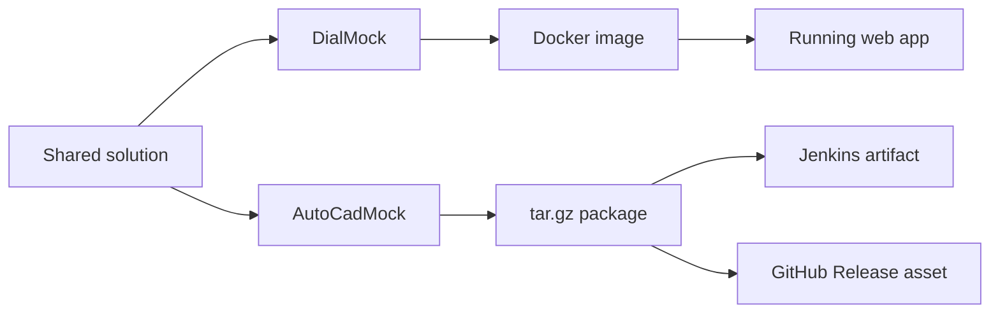

# CI/CD

## What exists

This repository uses 4 Jenkins pipeline jobs:

- `dialmock-ci`
- `dialmock-deploy`
- `dialmock-desktop-build`
- `dialmock-desktop-release`

Runtime split:

- `DialMock` → Docker web container
- `AutoCadMock` → desktop package / GitHub Release asset

---

## Pipeline map

```mermaid
flowchart TD
    A[GitHub repository] --> B[dialmock-ci]
    A --> C[dialmock-deploy]
    A --> D[dialmock-desktop-build]
    A --> E[dialmock-desktop-release]

    B --> F[Build + test in Docker]
    F --> G[Publish DialMock artifact]
    F --> H[Publish AutoCadMock artifact]

    C --> I[Build DialMock runtime image]
    I --> J[Deploy web container]

    D --> K[Package Linux desktop archive]
    K --> L[Archive in Jenkins]

    E --> M[Package Linux desktop archive]
    M --> N[Upload to GitHub Release]
````

---

## Before creating Jenkins jobs

Jenkins host must have:

* Git
* Docker
* Jenkins user in the `docker` group

Example:

```bash
sudo usermod -aG docker jenkins
sudo systemctl restart jenkins
```

---

## Create Jenkins jobs

For **each** job:

* **New Item**
* **Item type**: `Pipeline`
* **Definition**: `Pipeline script from SCM`
* **SCM**: `Git`
* **Repository URL**: `https://github.com/nathabee/csharp.git`
* **Branch Specifier**: `*/main`

Use these script paths:

| Job name                   | Script path                   |
| -------------------------- | ----------------------------- |
| `dialmock-ci`              | `Jenkinsfile.ci`              |
| `dialmock-deploy`          | `Jenkinsfile.deploy`          |
| `dialmock-desktop-build`   | `Jenkinsfile.desktop-build`   |
| `dialmock-desktop-release` | `Jenkinsfile.desktop-release` |

If the GitHub repository is public, no checkout credential is required.
If it is private, add the Git credential in the SCM section.

---

## What each job does

### `dialmock-ci`

* build whole solution in Docker
* run tests
* publish web artifact
* publish desktop artifact
* archive Jenkins artifacts

### `dialmock-deploy`

* build `DialMock` runtime image
* deploy the web container

### `dialmock-desktop-build`

* package Linux desktop archive
* archive `.tar.gz` in Jenkins

### `dialmock-desktop-release`

* package Linux desktop archive
* archive `.tar.gz` in Jenkins
* create or update GitHub Release
* upload release asset

---

## GitHub token for release job

This is needed only for:

* `dialmock-desktop-release`

### Step 1 — Create token in GitHub

Create a token for repository:

```text
nathabee/csharp
```

Minimum permission:

* **Contents** → read and write

### Step 2 — Store token in Jenkins

In Jenkins:

* **Manage Jenkins**
* **Credentials**
* choose global store
* **Add Credentials**

Use:

* **Kind**: `Secret text`
* **ID**: `github-token`
* **Secret**: paste the GitHub token

This must exist before running `dialmock-desktop-release`.

---

## Release job parameters

When running `dialmock-desktop-release`, fill these:

* `RELEASE_TAG` → required
  example: `v1.2.1`

* `RELEASE_NAME` → optional
  example: `AutoCadMock Linux v1.2.1`

* `TARGET_COMMITISH` → usually
  `main`

* `GITHUB_REPOSITORY` → usually
  `nathabee/csharp`

* `GITHUB_TOKEN_CREDENTIALS_ID` → usually
  `github-token`

* `DRAFT` → `true` or `false`

* `PRERELEASE` → `true` or `false`

### First release example

* `RELEASE_TAG = v1.2.1`
* `RELEASE_NAME = AutoCadMock Linux v1.2.1`
* `TARGET_COMMITISH = main`
* `GITHUB_REPOSITORY = nathabee/csharp`
* `GITHUB_TOKEN_CREDENTIALS_ID = github-token`
* `DRAFT = true`
* `PRERELEASE = false`

---

## Produced outputs

### `dialmock-ci`

Archives:

```text
artifacts/testresults/
artifacts/DialMock-web/
artifacts/AutoCadMock-desktop-linux-x64/
```

### `dialmock-desktop-build`

Archives:

```text
artifacts/AutoCadMock-desktop-linux-x64.tar.gz
```

### `dialmock-desktop-release`

Archives:

```text
artifacts/AutoCadMock-desktop-linux-x64.tar.gz
```

and uploads the same file to GitHub Release.

---

## Where to get the artifact

### From Jenkins

* open the job
* open the build
* open **Artifacts**
* download the file

Example:

```text
artifacts/AutoCadMock-desktop-linux-x64.tar.gz
```

### From GitHub Release

After running `dialmock-desktop-release`, download from the created release asset.

---

## Delivery model



---

## Notes

* `artifacts/` and `TestResults/` stay in `.gitignore`
* Jenkins archives generated files; they are not committed to Git
* `DialMock` is deployed as a service
* `AutoCadMock` is distributed as a client package
 