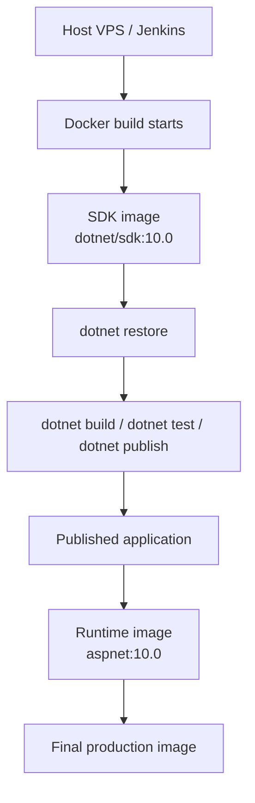

# CI/CD

## Model

This project uses a **Docker-only CI model**.

Jenkins does **not** need the .NET SDK installed on the host machine.  
Build and test run inside Docker stages based on the **`.NET SDK` image**, while the final production image contains only the published application and the **ASP.NET runtime**.

This is a **multi-stage Docker build**.

### Build stages

1. **restore**  
   Copies solution and project files, then runs `dotnet restore`

2. **test**  
   Copies the full source, builds the solution, and runs the tests

3. **publish**  
   Publishes the Blazor app into a clean output directory

4. **runtime**  
   Creates the final lightweight production image without the SDK

## Build flow

When Jenkins runs:

```bash
docker build .
```

the process is:



The host only needs:

* Jenkins
* Git
* Docker

The host does **not** need:

* .NET SDK

---

## Workflow

### Production-style lifecycle

```mermaid
flowchart TD
    A[Developer PC] -->|git push| B[GitHub repository]
    B -->|webhook| C[Jenkins CI]
    C --> D[Checkout source into workspace]
    D --> E[Build and test in Docker]
    E --> F[Docker image created]
    F --> G[Docker registry<br/>(optional later)]
    F --> H[Production deployment]
    G --> H
    H --> I[Container running]
```

### Environment roles

#### Dev

Used to:

* write code
* test locally
* commit and push source

#### CI

Used to:

* receive webhook from GitHub
* checkout the source into Jenkins workspace
* build and test in Docker
* create the Docker image

#### Release

Used to:

* tag the image
* optionally push the image to a registry
* optionally archive build artifacts in Jenkins

#### Deploy

Used to:

* pull the released image
* run or replace the container
* never rebuild from source in integration, acceptance, or production

---

## Physical files

### Main files

```text
Dockerfile
Jenkinsfile
scripts/ci-build.sh
scripts/ci-test.sh
scripts/ci-docker-build.sh
scripts/ci-docker-push.sh
scripts/ci-deploy.sh   # later, when deployment is automated
```

### Test documentation

See:

[docs/test.md](docs/test.md)

 
